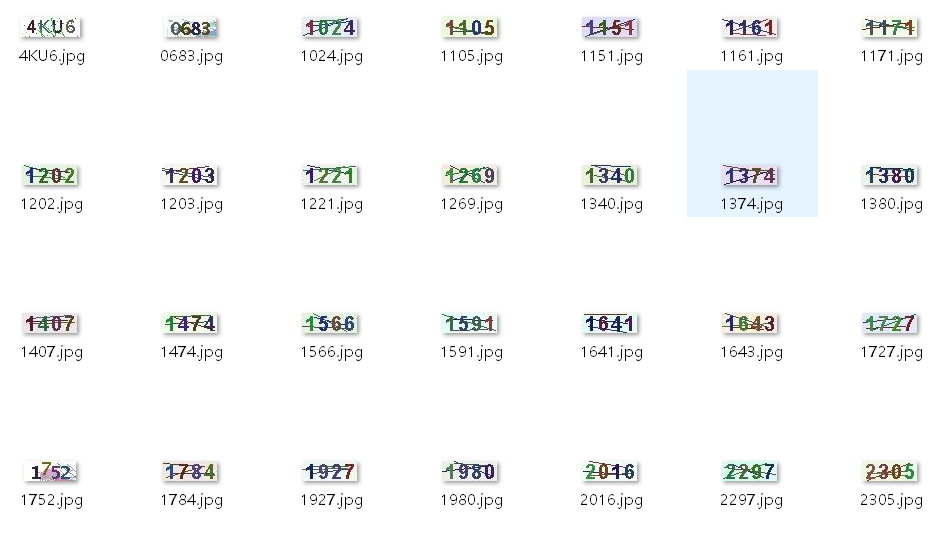
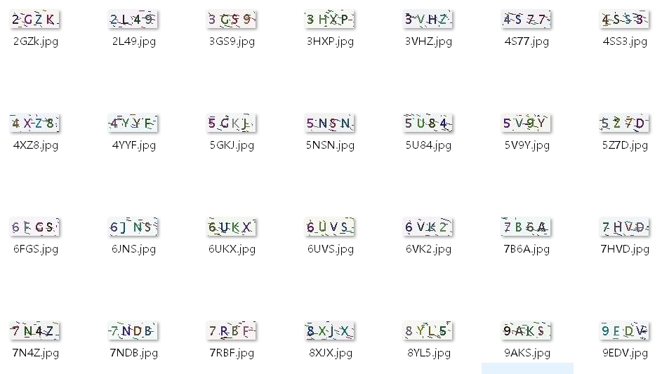
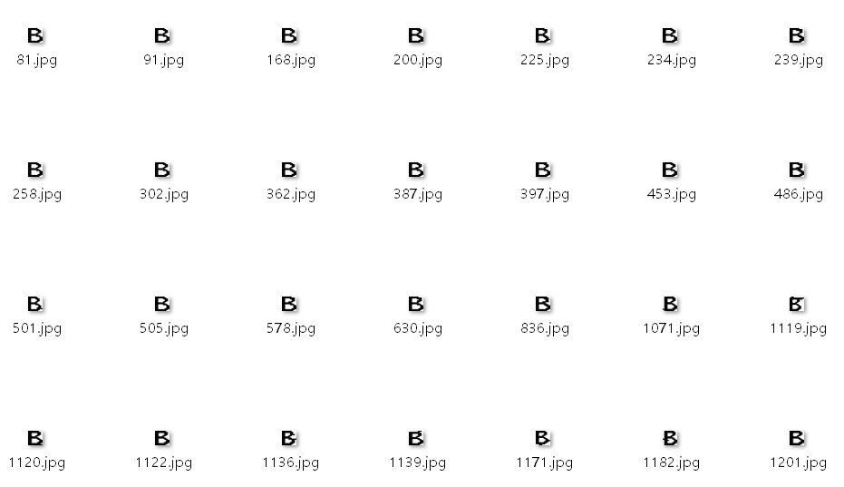
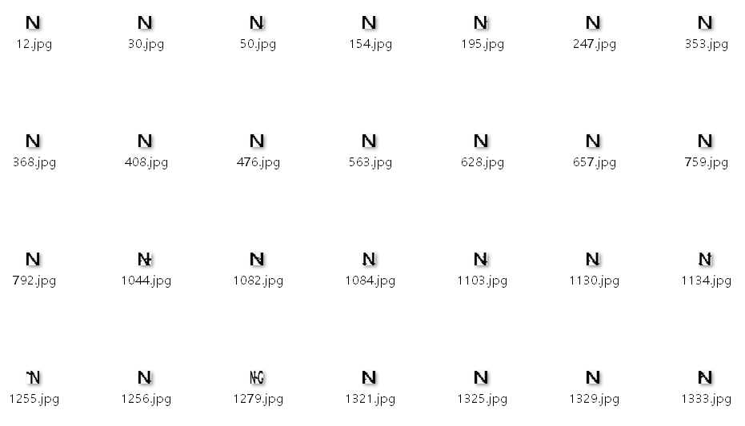

# Verification Code Recognition
This repository is mainly about auto recognizing verification code. A method called "Drip algorithm" is used to cut the picture into parts which is convenient for subsequent identification operations.

## Introduction
  `./cut_algorithm`: Mainly cut algorithm programed in matlab language.

  `./cut_algorithm/leach.m`: Function that used to leach noise dot.

  `./cut_algorithm/smooth.m`: Function that used to smooth the picture.

  `./cut_algorithm/data2_type8.m`: Main script to run which is mainly focused on the deta in `./data/4nngn1`.
  `./data`: Several types of captcha data, which is named by some principles:

**Folder name meaning analysis**

First marker character: `4` `5` `6`

1.  `4` There are four characters in the picture

2.  `5` There are five characters in the picture

3.  `6` There are six characters in the picture

Second mark character: `s` `n`

1.  `s` single color (the color of the character to be recognized, regardless of the background color)

2.  `n` color, non-single color

Third marker character: `x` `n`

1.  `x` characters have rotation and overlap, scattered arrangement

2.  `n` characters do not have rotation and overlap, neatly arranged

Fourth marker character: `g` `n`

1.  `g` There is interference (referring to the long horizontal line of the foreground,excluding the short lines and noise points of the background, etc.)

2.  `n` no interference

Fifth marker character: `q` `n`
1.  `q` character is distorted
2.  `n` no distortion

The sixth and subsequent mark characters: `A`  `a` `123`
1.  `A` means uppercase letters are included
2.  `a` means that lowercase letters are included
3.  `123` means contains numbers

  `./data_cut`: Algorithm cut result, each character is saved in its belonging folder.
  `./source`: Tensorflow is used to recognize the cutted subimage.
  `./captcha_data`: Train and Test data for CNN.
## Source images

## Cut subimage samples
### `8` cut result

### `N` cut result

# Contact
**Email**: shp395210@outlook.com
